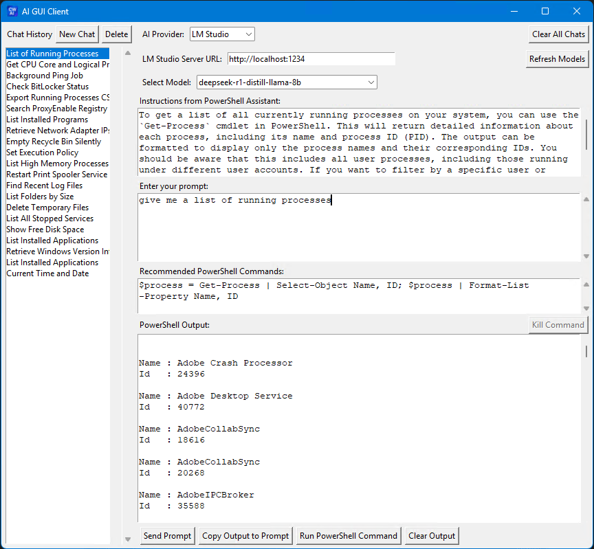
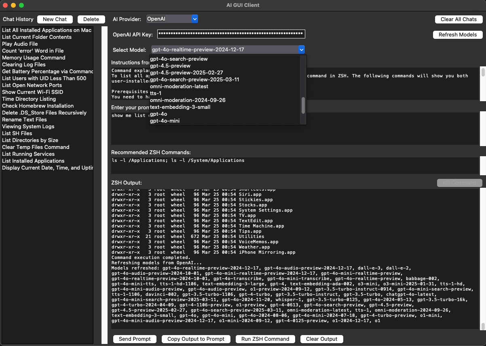
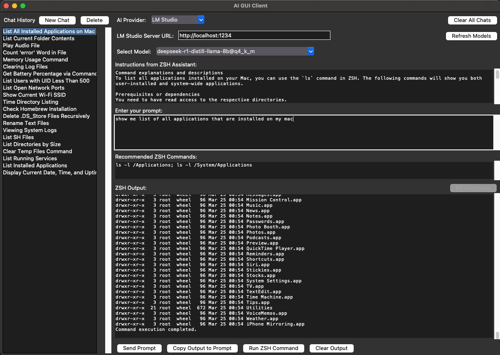

# AI GUI Client

A cross-platform desktop application that provides an intuitive interface for interacting with AI language models through both OpenAI's API and LM Studio's local server.

## Features

- 🔄 Support for both OpenAI API and LM Studio local models
- 💻 Cross-platform compatibility (Windows and macOS)
- 🗂️ Chat history management with persistent storage
- 🛠️ System command generation and execution
- 📝 Real-time command output display
- 🔍 Model selection and refresh capabilities
- 🔒 Secure API key handling

## Screenshots

### Windows Version

#### OpenAI Integration

*OpenAI integration with model selection and API key configuration*

#### LM Studio Integration

*LM Studio local server integration with process listing functionality*

### macOS Version

#### OpenAI Integration

*OpenAI integration showing system command generation*

#### LM Studio Integration

*LM Studio integration displaying application listing functionality*

## Installation

### Pre-built Binaries

1. Download the latest release for your platform:
   - Windows: `AIPrompt-win.exe` from the releases page
   - macOS: `AIPrompt-mac.zip` from the releases page

2. For macOS:
   - Extract `AIPrompt-mac.zip`
   - Move `AIPrompt.app` to your Applications folder
   - Right-click and select "Open" the first time to bypass Gatekeeper

3. For Windows:
   - Run `AIPrompt-win.exe`
   - If SmartScreen appears, click "More Info" and "Run Anyway"

### Building from Source

Prerequisites:
- Python 3.8 or higher
- pip (Python package installer)
- Git
- GitHub Personal Access Token (for release management)

```bash
# Clone the repository
git clone https://github.com/yourusername/AIPrompt.git
cd AIPrompt

# Create and activate virtual environment
python -m venv .venv
# On Windows:
.venv\Scripts\activate
# On macOS:
source .venv/bin/activate

# Install dependencies
pip install -r requirements.txt
```

#### Build and Release Process

The project uses a cross-platform build pipeline that handles version management and releases:

1. **Creating a New Release**
   ```bash
   # Set your GitHub token
   export GITHUB_TOKEN=your_github_token  # On macOS/Linux
   $env:GITHUB_TOKEN = "your_github_token"  # On Windows

   # Create a new release (increment version and build)
   python version.py [major|minor|patch] "Your release description"
   ```
   This will:
   - Increment the version number
   - Update the changelog
   - Build for the current platform
   - Create a GitHub release
   - Upload the current platform's build

2. **Building for Other Platforms**
   After creating a release on one platform, build for the other platform:
   ```bash
   # On Windows:
   .\build-win.ps1
   # On macOS:
   ./build-mac.sh
   ```
   The build script will:
   - Build the application
   - Automatically update the latest GitHub release with the new platform build

3. **Manual Building (without release)**
   To build without creating a release:
   ```bash
   # On Windows:
   .\build-win.ps1
   # On macOS:
   ./build-mac.sh
   ```
   Builds will be available in the `release` directory.

#### Build Output Locations
- Windows: `release/AIPrompt-win.exe`
- macOS: `release/AIPrompt-mac.zip`

## Usage

### Setting up AI Providers

#### OpenAI
1. Select "OpenAI" from the AI Provider dropdown
2. Enter your OpenAI API key
3. Click "Refresh Models" to load available models
4. Select your desired model from the dropdown

#### LM Studio
1. Start LM Studio and load your desired model
2. Select "LM Studio" from the AI Provider dropdown
3. Ensure the Server URL is set to `http://localhost:1234` (default)
4. Click "Refresh Models" to load available models
5. Select your desired model from the dropdown

### Working with Chats

1. **New Chat**: Click "New Chat" to start a fresh conversation
2. **Chat History**: Previous chats are saved automatically and can be accessed from the left sidebar
3. **Delete Chats**: Select one or more chats and click "Delete" to remove them
4. **Clear All**: Use "Clear All Chats" to remove all chat history

### Executing Commands

1. Enter your prompt in the input field
2. Click "Send Prompt" to generate commands
3. Review the generated instructions and commands
4. Click "Run Command" to execute the suggested command
5. Use "Kill Command" if needed to stop long-running processes
6. "Copy Output to Prompt" allows you to use command output in your next prompt

## Data Storage

- Windows: Chat history and logs are stored in `%APPDATA%\AIPrompt`
- macOS: Chat history and logs are stored in `~/Library/Application Support/AIPrompt`

## Version History

See [CHANGELOG.md](CHANGELOG.md) for a detailed list of changes in each version.

## License

This project is licensed under the MIT License - see the [LICENSE](LICENSE) file for details. 
## Releases

Latest release: v1.1.0

### Download Latest Release
- [Windows (AIPrompt-win.exe)](https://github.com/CWade3051/AIPrompt/releases/latest/download/AIPrompt-win.exe)
- [macOS (AIPrompt-mac.zip)](https://github.com/CWade3051/AIPrompt/releases/latest/download/AIPrompt-mac.zip)

For older releases, visit the [GitHub releases page](https://github.com/CWade3051/AIPrompt/releases).